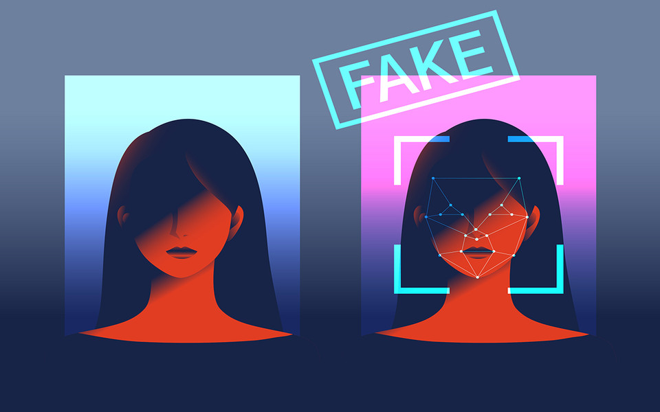

# 딥페이크 영상 탐지 모델의 효과적인 딥러닝 백본 연구

##### [2024년 대한전자공학회 하계학술대회]

Seongho Kim, **Byeongwoo Son**, Hyoju Ahn, Changgyun Jin, [*Efficient Deep Learning-based Deepfake Detection with Local and Global Temporal Information*](https://www.dbpia.co.kr/journal/articleDetail?nodeId=NODE11891080) , in Proceedings of the 2024 대한전자공학회 하계학술대회, 2024. 

## 1. Intro

### 프로젝트 개요

    </img>

최근 인공지능 및 비디오 영상 기술의 발전으로 인해 딥페이크 영상의 생성이 쉬워지고 있습니다. 이러한 딥페이크 영상은 실제 영상과 거의 구별할 수 없는 수준으로 정교해지고 있어, 사회적으로 큰 문제를 일으키고 있다고 있습니다. 딥페이크 영상은 SNS 및 다른 온라인 플랫폼에서 확산되어 특정 인물의 명예를 훼손하거나, 가짜 정보를 유포하는 등의 악용이 우려되고 있습니다.

이러한 상황에서, 딥페이크 영상을 탐지하여 가짜임을 명확히 식별하는 인공지능 모델의 필요성이 대두되고 있습니다. 따라서 본 프로젝트는 **딥페이크 영상을 식별하고 탐지하는 인공지능 모델을 개발하는 것**을 목표로 합니다.

본 프로젝트는 딥러닝 및 컴퓨터 비전 기술을 기반으로 하여, 딥페이크 영상의 특징과 패턴을 학습하여 실제 영상과의 차이점을 파악하는 모델을 구축합니다. 

실제 비디오 영상에서 **시간적인 정보를 더 효과적으로 추출하는데 초점**을 두어 실험을 진행했으며, 대용량의 데이터셋을 사용하지 않았음에도 기존 딥페이크 탐지 모델보다 뛰어난 성능을 얻었습니다.

## 2. Deepfake Detection

### Deepfake기술

> **딥페이크(deepfake) 란 ?**
AI의 학습기술인 Deep Learning과 가짜 Fake라는 단어를 조합해 만들어진 용어로,
딥러닝과 인공지능 기술을 사용하여 인간 얼굴이나 음성을 합성하거나 변조하는 기술입니다.
> 
- 특징
    - 기존에 있던 인물의 얼굴이나, 특정 부위를 영화의 CG처리처럼 합성한 영상편집물을 말합니다.
    과거에는 인물의 사진이나 영상을  수동으로 합성을 진행했다면, 현재에는 디지털 기술과 인공지능의 발전으로 자연스럽고 정교한 합성이 가능합니다.
    - 딥페이크의 주요 원리는 고화질의 동영상을 사용하여 딥러닝 알고리즘을 훈련시킨 후, 이를 통해 대상이 되는 인물의 동영상을 프레임 단위로 합성하는 것입니다.
    - 딥러닝 알고리즘을 사용하기 때문에, 병렬연산장치의 성능에 따라 속도와 품질이 결정됩니다.

- 딥페이크 기술의 문제점
    
    

    </img>
    

    
    - 딥페이크 기술은 엔터테인먼트 산업이나 이미지처리 및 딥러닝 분야에서의 다양한 연구와 개발에 적용될 수 있는 장점도 있지만, 위의 사례처럼 허위정보나 인권침해와 같은 윤리적 문제도 함께 떠오르고 있습니다.
    - 가장 잘 알려진 문제점으로는 해당 기술을 통해 연예인들과 같은 유명 인물을 위조하여 악용하는 점이며,  포르노 합성에도 사용되고 있어 인권침해 사례가 다수 발생하고 있다고 합니다.
    가장 최근에는 러시아와 전쟁을 겪고 있는 우크라이나의 젤린스키 대통령이 등장하는 가짜 영상이 공개되어 화제가 되기도 했습니다.

### Deepfake Detection

> **딥페이크 탐지(Deepfake Detection)?**
> 
> 
> 딥페이크 탐지란 딥페이크 기술을 사용하여 생성된 가짜 영상이나 음성을 식별하고 구별하는 기술이며, 주로 기존의 딥러닝 및 컴퓨터 비전 기술을 사용하여 수행됩니다. 딥페이크의 문제점이 떠오르면서 동시에 딥페이크 탐지 기술또한 발전하는 중입니다.
> 
- 기존의 다양한 딥페이크 탐지 기술
    - [Face Forgery Detection](https://github.com/clpeng/Awesome-Face-Forgery-Generation-and-Detection#face-forgery-detection)
        - [Spatial Clue for Detection](https://github.com/clpeng/Awesome-Face-Forgery-Generation-and-Detection#spatial-clue-for-detection)
        - [Temporal Clue for Detection](https://github.com/clpeng/Awesome-Face-Forgery-Generation-and-Detection#temporal-clue-for-detection)
        - [Audio+ Clue for Detection](https://github.com/clpeng/Awesome-Face-Forgery-Generation-and-Detection#audio-clue-for-detection)
        - [Generalizable Detection](https://github.com/clpeng/Awesome-Face-Forgery-Generation-and-Detection#generalizable-clue-for-detection)
        - [Spoofing Detection](https://github.com/clpeng/Awesome-Face-Forgery-Generation-and-Detection#spoofing-forgery-detection)

📌 **우리가 사용할 딥페이크 탐지 기술 : Temporal Clue for Detection**
Temporal Clue for Detection은 딥페이크 영상에서 원본과의 **시간적 일관성 부재를 파악**하여 탐지하는 기술입니다. 딥페이크 생성 과정에서 시간적인 불일치를 분석하고 이를 이상점으로 감지하여 딥페이크를 식별합니다. 예를 들어, 원본 영상과 딥페이크 영상의 피부 톤이나 객체의 움직임이 일관성이 없을 때 이를 정보로 딥페이크 탐지를 할 수 있습니다.

### 기존 Deepfake Detection 기술의 한계점

1️⃣ 기존의 딥페이크 영상 탐지 모델은 주로 CNN계열을 사용하는데, 이는 영상의 공간적 정보를 잘 활용할 수 있지만 시퀀스 데이터에서의 시간적인 패턴을 적절히 반영하지 못하는 경우가 있습니다. 

2️⃣ 대용량의 비디오 데이터셋을 이용하여 학습을 진행하기 때문에, 많은 컴퓨팅소스가 필요합니다. 

3️⃣ 딥페이크 기술은 계속해서 발전하고 있기 때문에, 새롭게 등장하는 특정 딥페이크 기술에 대한 일반화 성능이 낮습니다.

📌 **Our Deepfake Detection**

1. **대규모** **데이터셋을** **사용하지** **않고도** **효과적인** **성능을** **내는 탐지 모델** **설계**
- 기존 모델에서 사용한 대규모 데이터셋(50만 개)과 비교하여, 데이터셋 크기를 크게 줄인 상황(5000개)에서도 동일한 성능을 달성할 수 있는 새로운 백본을 실험하였습니다.
1. **비디오** **데이터에서** **시간정보를** **잘** **추출할** **수** **있도록** **하는** **딥러닝** **모델** **설계**
- 다양한 시퀀스 모델인 LSTM,GRU와 Transformer를 활용하여 시간 정보를 잘 추출할 수 있는 새로운 모델 설계했습니다.

## 3. Model

    </img>

### Two Stage methods

- 학습은 총 두 단계로 구성되어 있습니다. 첫번째 단계에서는 데이터에서 공간적&시간적 정보들을 추출한 후, 두번째 단계에서 분류(classification)와 분류를 도와줄 1단계의 표현학습(prediction)이 같이 학습되어 Fake Video를 탐지합니다.

    **(1) Stage1 : Spatial & Temporal representation learning ( Non-Contrastive Learning )**

    - stage1은 실제 영상과 오디오 데이터만을 이용해서 실제 영상의 공간적&시간적 표현들을 얻는 단계입니다.
    - Cross multi modal방식의 self-supervised learning을 사용하여 시간적으로 밀도있는 비디오 representation을 학습합니다.
        - **student and teacher pair for each modality** : 
        teachers produce targets, students from the other modality predict
        video teacher: target A 생성 ⇒  audio student: target A 예측
        audio teacher: target B 생성 ⇒  video student: target B 예측

    **(2) Stage2 : Fake video detection ( Multi-task Learning )**

    - Task 1 : Real / Fake Classification
        - 실제 영상과 딥페이크 영상을 가지고 Real영상인지 Fake영상인지 분류합니다.
    - Task 2 : Video Information Prediction
        - 1단계에 학습됐던 video학습 모델을 그대로 가져와 분류를 돕는 prediction을 수행합니다.

### 🌟 New Backbone

> 3DCNNGRU + Attention Model
> 

    </img>

- **`3D Convolutional Network`  :** Video 데이터(H*W*F(frames))를 처리 할 수 있는 CNN을 사용합니다.
    - Channel수는 RGB인 3으로 시작하지만, 3dConv 를 거쳐 256개의 표현으로 늘어나고 최종적으로 GRU에 입력하기 위해 flatten을 사용합니다.
- **`Gate recurrent Unit (GRU)` :** 시간적 정보를 효과적으로 추출하기 위해 시퀀스데이터 계열의 모델인 GRU 사용합니다.
    - GRU는 LSTM(Long Short-Term Memory)과 비슷한 기능을 가지고 있지만, 더 간단한 구조로 시간적 데이터의 패턴 및 특징을 파악하고 다음 프레임의 예측에 활용할 수 있습니다.
    - 따라서 딥페이크 영상의 시간적 일관성을 보다 정확하게 분석하고 탐지할 수 있습니다.
- **`Attention` :** 시간 차원에 **중요도 가중치**를 계산하여 비디오 시퀀스에서 특정 시간 단계의 특성들의 중요도를 높이기 위해 Attention 모듈을 사용합니다.
    - 각 시간 단계에서의 특성에 대한 가중치를 동적으로 할당하여 모델이 더 집중해야 할 중요한 프레임을 강조합니다.

## 4. Dataset

### (1) Stage1 (Real data)
    

</img>

- The Oxford-BBC **Lip Reading in the Wild (LRW)** Dataset
    - 수백 명의 사람이 말하는 500개 다른 단어의 최대 1000개 문구로 구성된 비디오 영상으로, 모든 비디오는 29프레임 (1.16초) 길이이며, 총 50만개의 데이터입니다.
    - 우리는 **`5,000개의 데이터`**만을 이용해서 학습을 진행하였습니다.
        
### (2) Stage2 (Fake data)
    
    
    
- **1. FaceForensics++**: Learning to Detect Manipulated Facial Images
    - 4가지의 얼굴 위조 방법으로 조작된 딥페이크 영상으로 구성된 5000개의 데이터셋으로, 위조 방법은 다음과 같습니다.
    - Deepfakes, Face2Face, FaceSwap,NeuralTextures
    

    </img>
    

- **2. FaceShifter:** Towards High Fidelity And Occlusion Aware Face Swapping
    - FaceForensic++ 팀과 협업하여 생성한 1000개의 고품질의 위조 영상 데이터셋입니다.
    - 현재 딥페이크 모델에서는 **FaceShifter 기술**에 대한 일반화 성능이 낮습니다.

    

    </img>
    

## 5. Experiment Setup

- **(1) Inputs**
    
    **[Video]**
    
    - Clip : 25 frames
    - Size : 112 x 112
    - random masking for students’ inputs
    
    **[Audio]**
    
    - 80 mel filters
    - 100 audio frames
    - random masking for students’ inputs
- **(2) Backbones**
    - **video backbone: New Backbone**
    - audio backbone: ResNet18
- **(3) Projectors**
    - single $1\times 1$ convolutional layer
- **(4) Predictors**
    - 1-block transformer encoder
- **(5) Etc**
    - Optimization : ****AdamP
    - Epochs: 150

## 6. Result

</img>

- 기존 모델보다 ssl_weight 를 0.3으로 조정하였을 때, 가장 좋은 결과가 나올 수 있었습니다.
- ssl_weight 란 마지막에서의 supervised loss 와 auxilary loss 값을 합하여 loss 를 결정할 때, auxilary loss 의 비중을 얼마나 주는지에 대한 파라미터로, 기존 1.0 을 주는 것과 다르게 우리는 여러 값 중 0.3 의 비중을 주었을 때 가장 좋은 결과가 나옴을 확인할 수 있었습니다.
- FaceShifter, CelebDf 에서 모두 기존의 CSN 을 이용한 성능보다 더 높게 나옴을 확인할 수 있었습니다.

## 7. Conclusion

- 모델 백본에서 기존 3D CNN 계열의 네트워크만 사용한 것과 달리, 시계열 데이터에서 효과적이었던 GRU와 self attention을 사용해 local & global temporal dependency를 모두 학습시킬 수 있었습니다.
- 또한, 기존 50만개의 비디오 데이터를 사용한 것과 달리 5천개만의 데이터를 이용하여 베이스라인보다 우수한 성능을 입증하여 모델의 효과성을 드러냈습니다.